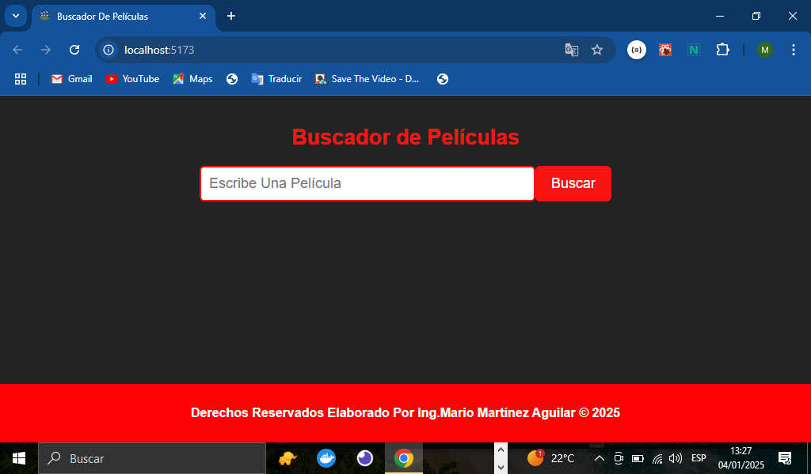
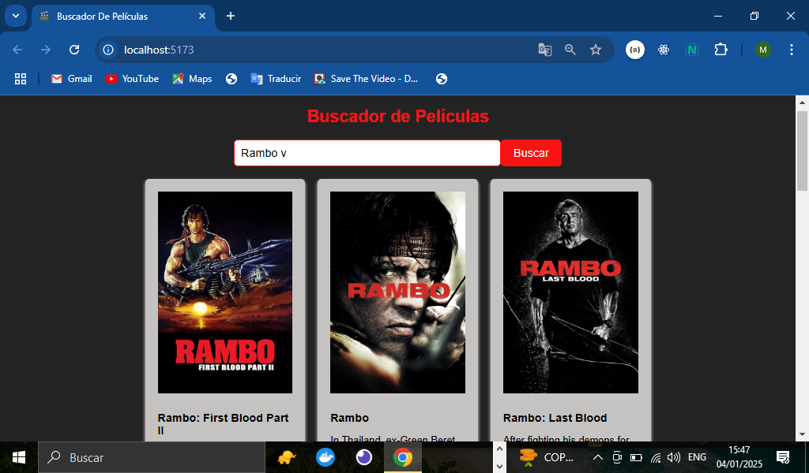
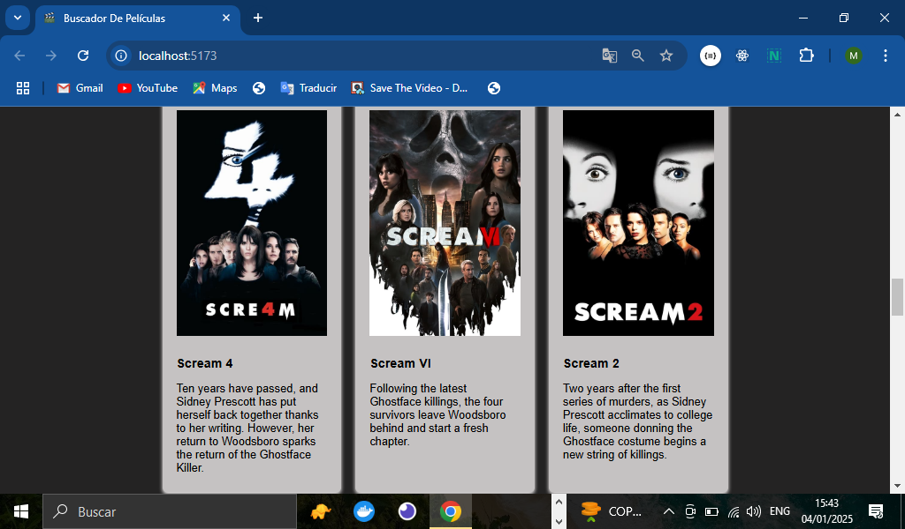
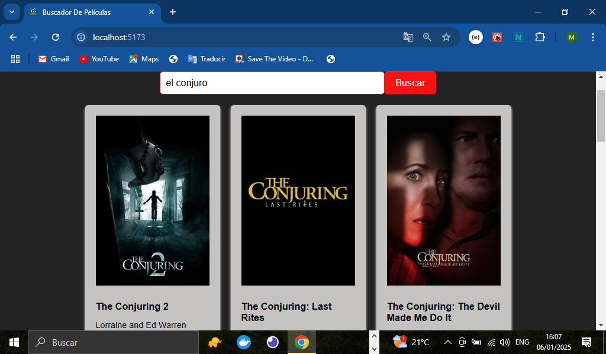

# TITULO DEL PROYECTO    

**Buscador De Películas Con React**

# DESCRIPCIÓN DEL PROYECTO (Pagina web Buscador de películas con React)
**Desarrollamos una página web, que contendrá un buscador de películas tendremos un input con un botón donde podremos buscar alguna película y el resultado nos lo mostrara abajo de la página todas las películas que tenga la API, para este proyecto consumimos una API de películas usando React al hacer el llamado de la API para traer las películas y poder mostrar alguna información en el DOOM que también nos brinda la API tal como lo es: el nombre de la película, una imagen, alguna descripción de la misma, a continuación explicare más a detalle el uso de React, componentes, estilos CSS y todo lo necesario para elaborar esta aplicación web**

## VISTA PREVIA DE NUESTRO BUSCADOR DE PELICULAS (Aplicación Web)


## CREACION DEL COMPONENTE BuscadorPeliculas.jsx(React)
**Para este proyecto creamos un componente llamado BuscadorPeliculas.jsx en este componente dentro del return contiene todo lo que vemos en la aplicación como lo es el título(<h1>), el input donde escribe el usuario la película que quiere buscar, además el botón donde presionamos para buscar y también toda la parte de la información de la película cuando se busca es decir la información que traemos cuando consumimos la API a continuación muestro el código del componente donde contiene los elementos mencionados anteriormente, puedes checar el código completo del componente en el archivo BuscazdorPeliculas.jsx de nuestro repositorio:**
```Jsx
    <div className="container">
        <h1>Buscador de Películas</h1>
        <form onSubmit={handleSubmit}>
            <input 
                type="text"
                placeholder="Escribe Una Película"
                value={busqueda}
                onChange={handleInputChange}
            />
            <button type="submit" className="search-button">Buscar</button>
        </form>
```
## VISTA PREVIA DE NUESTRO BUSCADOR DE PELICUALS YA FUNCIONANDO

## AQUI BUSCAMOS OTRA PELICULA EN EL BUSCADOR


## USO DE EL HOOK EN REACT QUE UTILIZAMOS(useState)
**Para realizar esta aplicación hicimos uso de uno de los Hooks de React que es el useState este nos va permitir poder llevar el control del valor del input y de lo que escriba el usuario es decir el valor va ir cambiando y con el useState podemos ir manipulando ese valor a través del setBusqueda a continuación se muestra una fragmento de código del componente BuscadorPeliculas.jsx de nuestro repositorio donde colocamos lo antes mencionado(código completo en el archivo de nuestro repositorio)**
```Jsx
    import { useState } from "react"
    const [busqueda, setBusqueda] = useState('')
```
## MANIPULANDO EL VALOR DEL INPUT(value,onChange y handleInputChange)
**Ahora para que el useState funcione hay que aplicar unas propiedades al input que son el value que recibe el primer parámetro del Hook(useState) y el onChange recibe la función handleInputChange esta función es para llevar el control del cambio del valor de estado en el setBuscador que es el segundo parámetro del useState, como podemos apreciar en el siguiente código**
```Jsx
    // propiedades del input value y onChange
    <input 
        type="text"
        placeholder="Escribe Una Película"
        value={busqueda}
        onChange={handleInputChange}
    />
    // función handleInputChange que recibe el onChange
     const handleInputChange = (e) => {
        setBusqueda(e.target.value)
    }
```
## PROPIEDADES EN EL FORM onSubmit Y FUNCION handleSubmit
**Para poder evitar que la página se actualice a la hora del submit en el botón vamos a prevenirlo para que no se recargue la página para esto hacemos uso de las propiedades onSubmit y la función handleSubmit, la propiedad onSubmit se aplica en el form que contiene el input y la y lo que este recibe el la función handleSubmit como se puede apreciar en el código de nuestro componente:(código completo en el archivo de nuestro repositorio)**
``` Jsx
    // propiedad onSubmit y la función que handleSubmit que es la que recibe
    <form onSubmit={handleSubmit}></form>
    // función(handleSubmit) que previene que la página se recargue
    const handleSubmit = (e)=>{
        e.preventDefault()
        fetchPeliculas()
    }
    // también recibe otra función(fetchPeliculas) esta se explicara más adelante
```
## USO DEL SEGUNDO HOOK useState EN NUESTRA APLICACION WEB
**El uso del segundo useState es para poder llevar el control de la información de la película que nos brinda la API es recibe un arreglo vacío ya que en Array de películas que nos trae la API como se muestra a continuación en el código de nuestro componente:**
```Jsx
    const [peliculas, setPeliculas] = useState([])
```
## CONSUMO DE LA API EN REACT(Variables(Url Y Apikey))
**Para poder consumir nuestra API de peliculas vamos hacer uso de algunas variables que contendrán el de la url de la API y lo que es el key de esa para poder manejar la información de manera segura ya que ese key nos lo proporciona la API para poder hacer uso de ella sin que nos genere algún error**
```JavaScript
    const url = 'https://api.themoviedb.org/3/search/movie'
    const API_KEY = '6fd6d3809e891955e11a3d5a57fea3d6'
```
# CONSUMO DE LA API,FUNCION fetchPeliculas Y CONTRUCCION DE LA URL
**Ahora vamos hacer la función fetchPeliculas que contiene el try y catch que es lo que usamos a la hora de hacer la petición GET a la API, para nuestro proyecto creamos la función fetchPeliculas ya que esta es una función asíncrona donde dentro del try manejamos como debe estar estructurada la URL, el manejo de la respuesta de la API en el formato JSON y el resultado es decir la data se lo pasamos a setPeliculas que es uno de los parámetros que declaramos en el segundo useState,la propiedad de JavaScript fetch es la encargada de cómo debe estar estructurada la URL, por otro lado dentro del catch manejamos lo que es el error en dado caso que la petición a la API falle como se puede ver en el siguiente fragmento de código:**
```JavaScript
    const fetchPeliculas = async () => {
        try{
            const response = await fetch(`${url}?query=${busqueda}&api_key=${API_KEY}`)
            const data = await response.json()
            console.log(data.results)
            setPeliculas(data.results)

        } catch(error){
            console.log('Ocurrió un error:' , error)
        }
    }
```
## MOSTRAR LA INFORMACION EN EL DOOM(título, la descripción y la imagen)
**Ahora con el uso de React vamos a mostrar la información de la película en la página, creamos un contenedor que contendrá toda la estructura de las tarjetas de todas las peliculas con la propiedad map podemos mapear todas las peliculas ya que la información de la API es un Array y con el uso de un key es decir un identificador podemos ir mostrando cada elemento del arreglo. Para mostrar la imagen de la película usamos una estructura de URL que nos proporciona la documentación de la API, toda esta información es en el contenedor div dentro del return de nuestro componente a continuación el código de lo explicado anterior mente todo el código completo en el archivo BuscadorPeliculas.jsx de nuestro repositorio**
```JavaScript
    <div className="movie-list">
        {peliculas.map((pelicula) => (
            <div key={pelicula.id} className="movie-card">
                
                <h2>{pelicula.title}</h2>
                <p>{pelicula.overview}</p>
            </div>
            
        ))}
    </div>
```
## DISENO CSS DE LAS CARDS DE LAS PELICULAS
**A continuación mostrare una parte del código CSS que usamos en este proyecto para poder darle diseño a las tarjetitas de cada pelicula tamaño de la imagen, sombras, bordes, fondos etc. Puedes checar el código completo del CSS en nuestro archivo buscador.css dentro de nuestra carpeta styles de nuestro repositorio**
```CSS
 .movie-list {
    display: grid;
    grid-template-columns: repeat(auto-fit, minmax(200px, 1fr));
    gap: 20px;
  }
  
  .movie-card {
    background-color: #c5c2c2;
    padding: 20px;
    border-radius: 6px;
    box-shadow: 0 3px 5px rgb(247, 243, 243);
  }
  
  .movie-card img {
    width: 100%;
    height: auto;
    margin-bottom: 10px;
  }
```

## IMAGEN DE LA CARDS DE LAS PELICULAS


### Lista De Tecnologías, Propiedades De React Y Herramientas Usadas En Nuestro Proyecto(Buscador De Peliculas)  

1. HTML
2. CSS 
3. JavaScript
4. React
5. Node.js Versión:v18.19.0(Entorno De Ejecución)
6. Manejo de APIS(fetch, async await)
7. Componentes En React 
8. Propiedades de React(map Y key(id))
9. Vite.js, Versión:5.3.4(Estructura De Carpetas Y Archivos) 
10. Hook De React(useState)
11. Git-Hub
12. Propiedades De La API(Url,Key(Construcción De La Url))
13. Propiedades De La Etiqueta Form(onSubmit)
14. Propiedades Del Input(onChange Y Value)
15. Manejo De Peticiones Y Errores A La API(try y catch)
16. Netlify(Publicación De La Página)

*Elaborado Por: Mario Martínez Aguilar*
